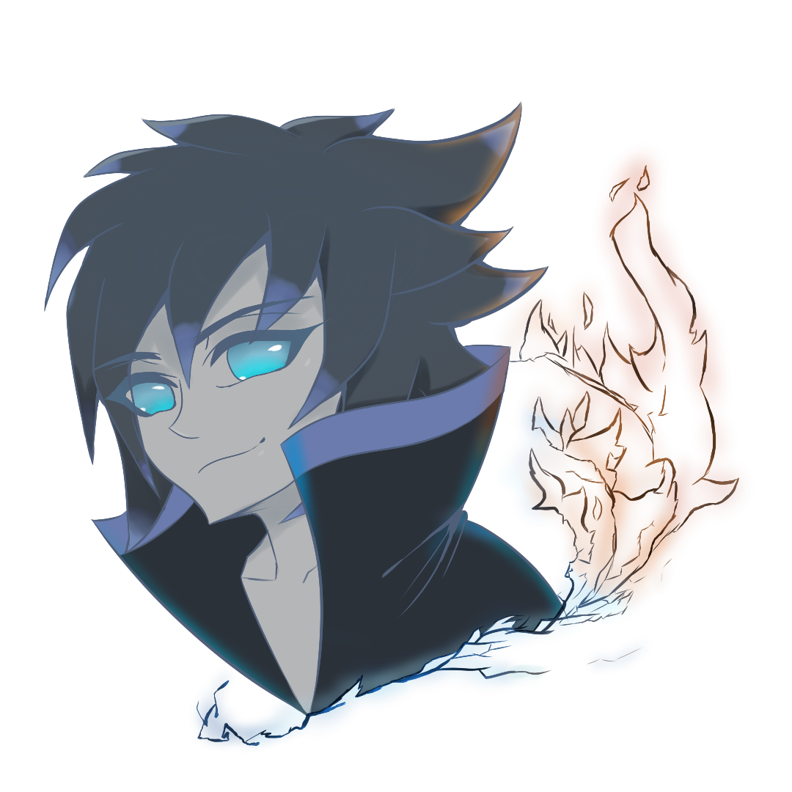

<h1> ★About★ </h1>

 

 -> Hi, im Manuel Gonçalves, im a 21 years old developer. 

 -> I am a 2nd year COMPUTER ENGINEERING student. 

<h1> ★Story★ </h1>

 -> I started programming in 2018 at school. 

 -> 2018/2019: C++; 

 -> 2019/2020: Java; 

 -> 2020/2021: HTML, CSS and PHP; 

 -> 2021/2022: JavaScript and C; 

 -> 2022: C#, Unity, React and Node; 

 -> 2023: Java, C; 

<h1> ★Current Learning★ </h1>

 -> I'm currently learning GAME DEVELOPMENT on the UNITY Engine | <a target=”_blank” href="https://learn.unity.com/u/5ff22d0fedbc2a002ba486f3?tab=profile"> Unity Profile </a>. 

 -> Learning JavaScript, C, C#, React and Node. 

<h1> ★Objectives★ </h1>

 -> Make my own GAMES; 

 -> In the future create my own COMPANY or TEAM; 

 -> Financial Freedom. 

<h1 align="center"> ★Contacts★ </h1>

   
  
  
  

 <a target=”_blank” href="mailto:solixxoficialcomercial@gmail.com">solixxoficialcomercial@gmail.com</a> 

<h1 align="center"> ★Languages & Tools★ </h1>

  
 

<h1 align="center"> ★Stats★ </h1>

  
  

 

<h1 align="center"> ★LeetCode★ </h1>
https://leetcode.com/ManuelGoncalves/

<!---

- 👋 Hi, I’m @Solixx
- 👀 I’m interested in web development and game development
- 🌱 I’m currently learning html, css, php, javascript e mysql.
- 💞️ I’m looking to collaborate on ...
- 📫 How to reach me manuel_jose_2002@hotmail.com

Solixx/Solixx is a ✨ special ✨ repository because its `README.md` (this file) appears on your GitHub profile.
You can click the Preview link to take a look at your changes.
--->
